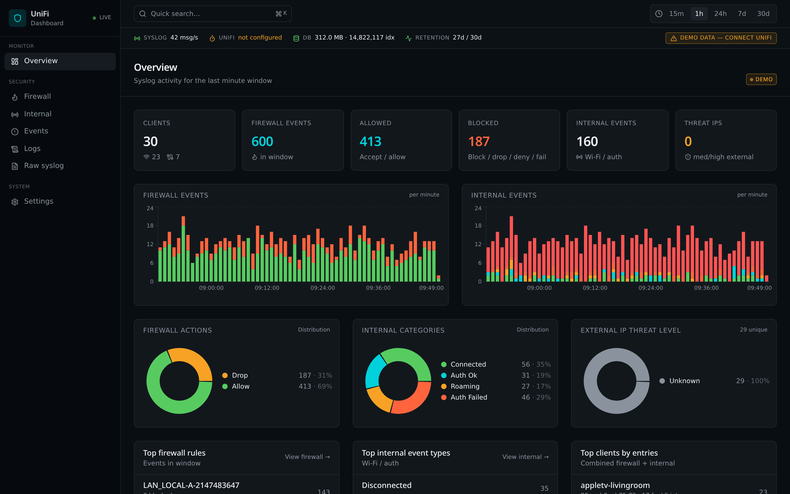
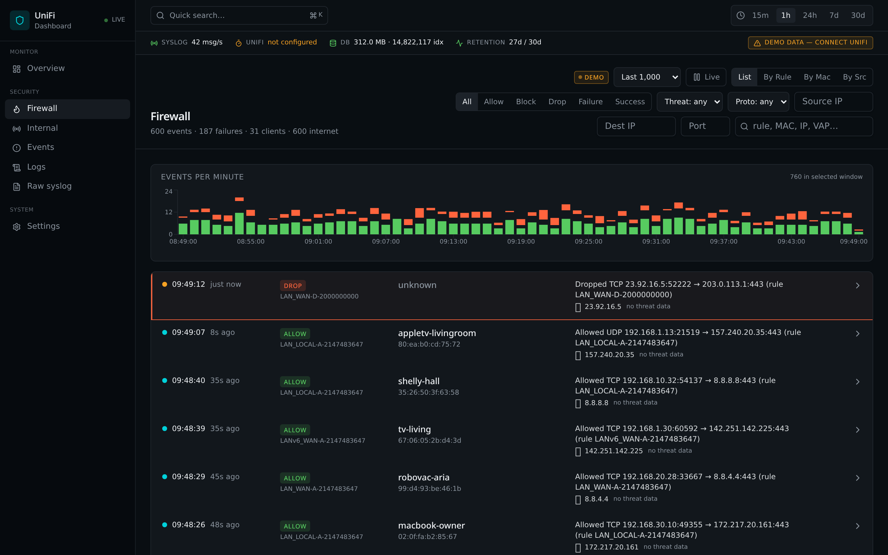
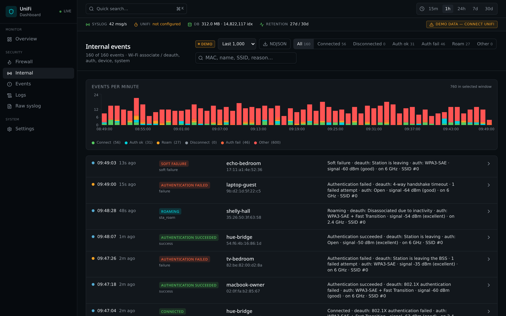
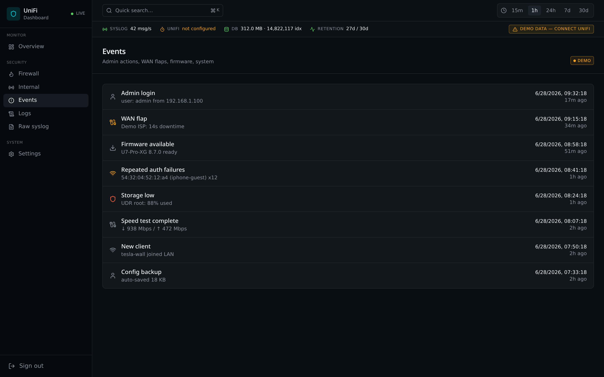
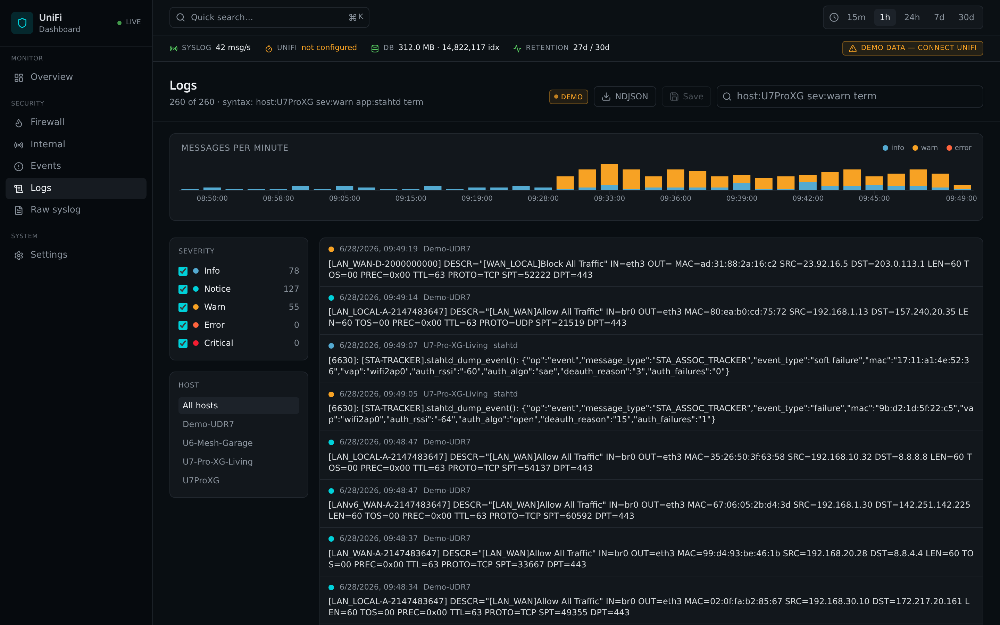
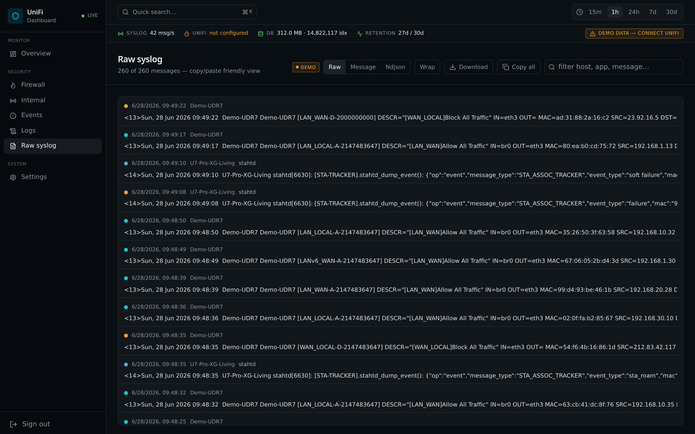

# FireSight

> Self-hosted **firewall log analyzer** and syslog dashboard for UniFi routers.
> One container. No external services. SQLite + FTS5 under the hood for fast
> search even on weeks of logs.

<p align="center">
  
</p>

FireSight acts as a **syslog server** for your UniFi Dream Router / UDM / UXG /
Cloud Gateway. It parses UniFi's firewall, STA-tracker and internal events,
enriches external IPs with country / ASN / threat-level data, and serves a
dark NOC-style web UI with first-class full-text search.

It's designed to run as a **single Docker container on Unraid** with one
volume — and nothing else.

---

## Table of contents

- [Features](#features)
- [Screenshots](#screenshots)
- [Architecture](#architecture)
- [Install — Unraid (Community Apps)](#install--unraid-community-apps)
- [Install — Docker / Docker Compose](#install--docker--docker-compose)
- [Configure your UniFi router](#configure-your-unifi-router)
- [First login](#first-login)
- [Timezone handling](#timezone-handling)
- [UniFi API (optional, read-only)](#unifi-api-optional-read-only)
- [Threat intelligence](#threat-intelligence)
- [Retention & cleanup](#retention--cleanup)
- [Environment variables](#environment-variables)
- [Updating](#updating)
- [Development](#development)
- [License](#license)

---

## Features

- **Syslog UDP/514 listener** for UniFi devices (RFC3164 + CEF).
- **Firewall view** — parsed `[WAN_LOCAL]`, `[LAN_IN]`, … rules, action chips,
  per-row country flag + threat level, red banner on `deny` / `drop` /
  `reject` / `block`, pause/resume so your search view doesn't get yanked
  out from under you.
- **Internal view** — Wi-Fi roam, auth, DHCP, admin actions translated into
  plain English instead of `{ADMIN} {PLATFORM} sta_assoc_tracker`.
- **Events view** — high-level event timeline with severity colouring.
- **Logs view** — full-text search over raw syslog via SQLite FTS5, with a
  dedicated *messages-per-minute* chart driven by the global time range.
- **Raw syslog view** — paste-friendly inspector for any single message.
- **Overview** — wired/wireless client counts (from UniFi API), per-minute
  firewall + internal event charts, donut breakdown of firewall actions /
  internal categories / external-IP threat level, parsing-health widget.
- **GeoIP & threat enrichment** — `ip-api.com` for country/ASN,
  [AbuseIPDB](https://www.abuseipdb.com/) for reputation, and **offline**
  IP/CIDR feeds (FireHOL, Spamhaus) matched in SQLite.
- **Retention** — by age, by firewall-age, and by hard DB size cap, with
  scheduled `VACUUM`.
- **Parsing health** — counts of accepted / rejected / TZ-skewed / CEF-failed
  events over time so you notice when something stops parsing.
- **Auth** — session cookie, forced password change on first login.

## Screenshots

| Overview | Firewall |
| --- | --- |
|  |  |

| Internal | Events |
| --- | --- |
|  |  |

| Logs (FTS5) | Raw syslog |
| --- | --- |
|  |  |

## Architecture

```
┌─────────────────────── firesight ───────────────────────┐
│  UDP :514   → parser → enrich → SQLite (WAL + FTS5)     │
│  HTTP :8095 → REST + WS + static React UI               │
│  worker     → UniFi controller poll (read-only, 10s)    │
│  worker     → threat-feed refresh (FireHOL/Spamhaus)    │
│  volume     → /data  (unifi.db + config.json)           │
└─────────────────────────────────────────────────────────┘
```

Frontend: React + TanStack Router + Tailwind v4 + Recharts.
Runtime: Node 22, Fastify, `better-sqlite3`, native `dgram` for UDP,
`undici` for the UniFi API (self-signed cert tolerated).

---

## Install — Unraid (Community Apps)

FireSight ships as a Community Apps template.

1. In Unraid: **Apps** → search for **FireSight** → click **Install**.
2. Confirm the default ports and `Appdata` path
   (`/mnt/user/appdata/firesight`).
3. Set **TZ** to your router's timezone (e.g. `Europe/Stockholm`). UniFi
   syslog timestamps have no timezone field — if this is wrong, your logs
   will appear 1–14 hours off. See [Timezone handling](#timezone-handling).
4. Click **Apply**. The container will boot, bind UDP/514, and serve the UI
   on `http://<unraid-ip>:8095`.

> Network mode is **host** by default so the syslog source IP matches the
> real UniFi device. If you need bridge mode, expose `8095/tcp` and
> `514/udp` and accept that every message will look like it came from the
> Docker gateway.

If you maintain your own Unraid Community Apps repository fork, point it at
[`unraid/ca_profile.xml`](unraid/ca_profile.xml) and
[`unraid/templates/firesight.xml`](unraid/templates/firesight.xml).

## Install — Docker / Docker Compose

### Docker run

```bash
docker run -d --name firesight \
  --network host \
  -e TZ=Europe/Stockholm \
  -v /mnt/user/appdata/firesight:/data \
  --restart unless-stopped \
  ghcr.io/tjindarr/unifi-insights-hub:latest
```

Without host networking:

```bash
docker run -d --name firesight \
  -p 8095:8095/tcp -p 514:514/udp \
  -e TZ=Europe/Stockholm \
  -v /mnt/user/appdata/firesight:/data \
  --restart unless-stopped \
  ghcr.io/tjindarr/unifi-insights-hub:latest
```

### docker-compose

See [`docker-compose.example.yml`](docker-compose.example.yml).

```bash
docker compose -f docker-compose.example.yml up -d
```

### Build locally

```bash
git clone https://github.com/Tjindarr/unifi-insights-hub.git
cd unifi-insights-hub
docker build -t firesight:local .
```

---

## Configure your UniFi router

In the UniFi console:

1. **Settings → System → Remote Logging / Remote Syslog**
2. Enable forwarding to your Unraid IP, **UDP**, port **514**.
3. Enable as many categories as you want (firewall is the most useful).

Within ~10 seconds you'll see events in **Logs** and **Firewall**.

### Enable syslog on the built-in firewall rules

To see both outbound internet traffic and inbound connection attempts, turn
on logging for UniFi's two default firewall rules:

1. **Settings → Security → Firewall & Port Forwarding**
2. Open the rule named **Allow All Traffic** (this is the default rule that
   lets all internal traffic go out to the internet).
3. Click **Edit** → enable **Syslog** → **Save**.
4. Open the rule named **Block All Traffic** (this is the default rule that
   blocks all incoming traffic on the external address).
5. Click **Edit** → enable **Syslog** → **Save**.

With these two rules logging, FireSight will show every connection your
clients make to the internet and every inbound probe blocked by the router.

### Read-only UniFi user (optional but recommended)


For client-name resolution in firewall logs and wired/wireless counts on the
Overview, create a UniFi **local** read-only admin:

1. UniFi console → **Admins & Users → Admins → Add Admin**
2. Choose **Restrict to local access only** and role **View Only**.
3. In FireSight → **Settings → UniFi controller**, enter the host
   (`192.168.1.1`), site (`default`), username, password.

The API poller is disabled if you leave these blank. The syslog half works
fine without it.

## First login

Default credentials are `admin` / `admin`. You'll be forced to set a new
password on first login. The session cookie is signed with a per-instance
secret stored in `/data/config.json`.

## Timezone handling

UniFi syslog uses RFC3164, which **has no timezone field**. The parser
interprets timestamps in the container's local timezone — so you must set
`TZ` to whatever your router is configured for.

```bash
docker run … -e TZ=Europe/Stockholm …
```

On Unraid, set the `TZ` variable on the template (default
`Europe/Stockholm`). You can also nudge by minutes in
**Settings → Time correction** without restarting the container.

## UniFi API (optional, read-only)

When configured, the API poller runs every 10 seconds and caches:

- Clients (for MAC → hostname / alias resolution).
- Device status (gateway / AP / switch).
- WAN counters.

All credentials live in `/data/config.json`, never in env vars after the
first launch. Rotate by editing in the UI; restart not required.

## Threat intelligence

- **GeoIP** lookups via `ip-api.com` (free, batched, cached).
- **AbuseIPDB** — paste an API key in **Settings → AbuseIPDB** to colour
  rows by abuse confidence score.
- **Offline feeds** — FireHOL Level 1 and Spamhaus DROP lists are pulled
  hourly and matched against firewall events using CIDR ranges stored in
  SQLite. No outbound calls per packet.

## Retention & cleanup

Three layered policies (configurable from **Settings**):

| Policy | Default | What it does |
| --- | --- | --- |
| `retentionDays` | 30 | Drops `syslog` rows older than N days. |
| `retentionFirewallDays` | 30 | Drops parsed `firewall_events` separately. |
| `maxDbMb` | 2048 | Hard ceiling on on-disk DB size. Oldest rows pruned to fit. |

Cleanup runs every `intervalMin` (default 60). `VACUUM` runs every
`vacuumHours` (default 24) to actually return freed pages to the
filesystem. A **Run cleanup now** button lives in Settings and at
`POST /api/retention/run`.

## Environment variables

Almost everything is configurable from the UI and persisted in
`/data/config.json`. Env vars only **seed** the file on first launch.

| Variable | Default | Purpose |
| --- | --- | --- |
| `TZ` | container default | Timezone used to interpret RFC3164 syslog timestamps |
| `HTTP_PORT` | `8095` | HTTP port for the dashboard |
| `SYSLOG_UDP_PORT` | `514` | UDP port the syslog listener binds to |
| `DB_PATH` | `/data/unifi.db` | SQLite database path |
| `CONFIG_PATH` | `/data/config.json` | Persistent settings file |
| `DASH_USER` | `admin` | Seed username (first launch only) |
| `DASH_PASSWORD` | `admin` | Seed password (forced change on first login) |
| `RETENTION_DAYS` | `30` | Seed retention for syslog |
| `RETENTION_FIREWALL_DAYS` | `RETENTION_DAYS` | Seed retention for firewall events |
| `RETENTION_MAX_DB_MB` | `2048` | Seed hard cap on DB size |
| `RETENTION_INTERVAL_MIN` | `60` | Seed cleanup interval |
| `RETENTION_VACUUM_HOURS` | `24` | Seed VACUUM interval |

## Updating

Unraid: **Apps → Installed Apps → Check for Updates → Update**.

Docker:

```bash
docker pull ghcr.io/tjindarr/unifi-insights-hub:latest
docker rm -f firesight
# re-run your `docker run …` command
```

The SQLite schema is migrated automatically on boot.

## Development

```bash
# frontend (Vite, mock-data only)
bun install
bun run dev          # http://localhost:8080

# backend (real syslog + UniFi)
cd server
npm install
DASH_USER=admin DASH_PASSWORD=admin npm start
```

The frontend proxies `/api` and `/ws` to `http://localhost:8095`. When
backend endpoints are unreachable the UI falls back to anonymized mock data
so every screen is designable without a real router.

## License

MIT — see [LICENSE](LICENSE).
